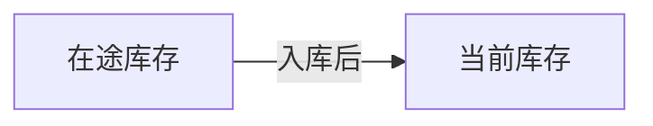
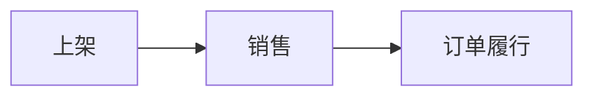
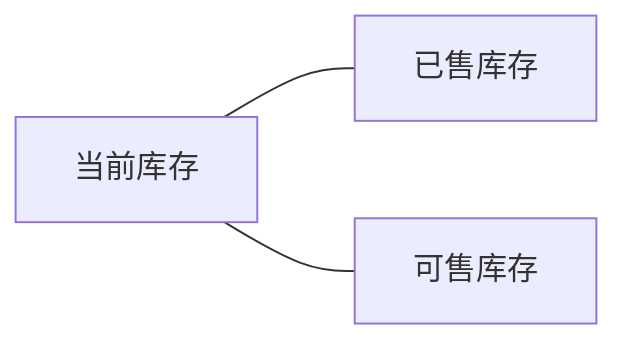
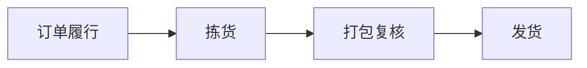
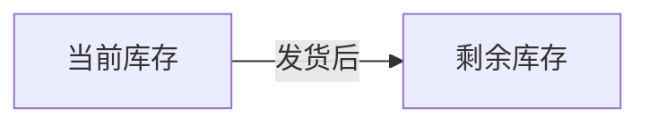

#### 采购环节

1. 采购流程

```mermaid
graph LR
供应商-->采购
采购-->到货
到货-->验收
验收-->入库
入库-->上架
```

2. 采购影响库存

```mermaid
graph LR
在途库存--入库后-->当前库存
```

#### 销售环节

1. 销售流程

```mermaid
graph LR
上架-->销售
销售-->订单履行
```

2. 销售流程影响库存

```mermaid
graph LR
当前库存---已售库存
当前库存---可售库存
```

#### 发货环节

1. 发货流程

```mermaid
graph LR
订单履行-->拣货
拣货-->打包复核
打包复核-->发货
```

2. 发货库存影响

```mermaid
graph LR
当前库存--发货后-->剩余库存
```

